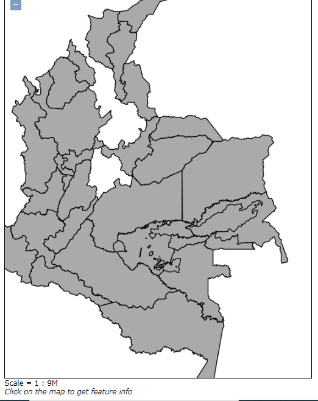

# ¿Cuál es el problema a tratar?
Se requiere saber los resguardos indígenas que hay en el país
## ¿Por qué la publicación de servicios OGC puede ayudar a resolverlo?
facilitan la disponibilidad y el acceso a la información geoespacial usando un conjunto de estándares y especificaciones definidas por la OGC y que permiten que las aplicaciones operen bajo condiciones conocidas.
##¿Qué servicios propone para la solución de su problema? WMS? WMTS? WFS? ¿Por qué?
Un servicio WMS, porque solo se requiere visualizar capas
## Descripción de los datos seleccionados (Origen, descripción, características especiales, atributos, url para descarga)
Resguardos_Indigenas
SDO_Deptos
Capas de Ejercito Nacional de cartografía básica y Áreas de Reglamentación Especial por convenio IGAC

## Descripción
-Primero se visualiza las capas a utilizar y sus atributos

-Luego se configura la  simbologia a utilizar, en este caso se da clic en la opcion de propiedades y realizamos la clasificacion de la capa

-Luego  se realiza la conexión a la base de datos  de posgres y se realiza la importacion de las capas

-Luego vamos a realizar las consultas en la el SQL que son las que se publicaran finalmente 
 se quiere saber en que departamentos hay resguardos indigenas
 create table tarea_heily as

select b.objectid as id,
a.departamen, b.shape
from (
select distinct departamen
from adminsige.sdo_deptos d,
adminsige.ri r
where MDSYS.SDO_RELATE(d.SHAPE,r.shape,'mask=anyinteract') = 'TRUE') a,
adminsige.sdo_deptos b
where a.departamen = b.departamen
 
 se quiere saber que resguardos indigenas hay en el departamento del Guainia 
 create table tarea_2 as            
select b.objectid as id,
a.rinombre, b.shape
from (
select distinct r.rinombre
from adminsige.sdo_deptos d,
adminsige.ri r
where MDSYS.SDO_RELATE(d.SHAPE,r.shape,'mask=anyinteract') = 'TRUE'
and d.departamen = 'GUAVIARE') a,
adminsige.ri b
where a.rinombre = b.rinombre

-Luego de tener las consultas, vamos a visualizar las capas creadas

-Luego vamos a ir a Geoserver y realizamos la carga de la capa, como la creacion de la capa se hizo directamente en la base de datos lo que vamos a realizar es la busqueda de ella. Para ello vamos a Cargar capa, buscamos la capa en la conexion postgis.

-Luego se subir las capas, vamos a la opcion de crear una agrupacion de capas donde  vamos a cargar las capas subidas y se configura el extent de las capas

-Luego vamos a previsualizar los datos

Luego de ello vamos a realiza el cambio u asignacion de estilos iniciando por el SLD , desde QGIS se puede  hacer la configuracion cuando se estaba realizando la clasificacion se da clic en guardar estilo  SLD, luego en el geoserver se da clic en crear un nuevo estilo, cargamos el archivo creado y podemos visualizar la leyenda y el archivo en html.

las dificultades presentadas es que al principio realice la conexion por oracle y fue complicado por cuestiones de persmisos y bloqueos, ademas en oracle hay que crear la geometria para que se pueda visualizar. La inserción de las imágenes ha sido complicada. Se me dificulto realizar el estilo CSS

##URL
http://34.83.176.208:18080/geoserver/clase/wms?service=WMS&version=1.1.0&request=GetMap&layers=clas
e%3AHR_1&bbox=-73.8378219604492%2C0.783906877040863%2C-67.8613815307617%2C3.69193458557129&width=768&height=373&srs=EPSG%3A4326&format=application/openlayers

http://34.83.176.208:18080/geoserver/clase/wms?service=WMS&version=1.1.0&request=GetMap&layers=clase%3AHR_2&bbox=-79.0077819824219%2C-4.22788381576538%2C-66.8472137451172%2C12.4573411941528&width=559&height=768&srs=EPSG%3A4326&format=application/openlayers

