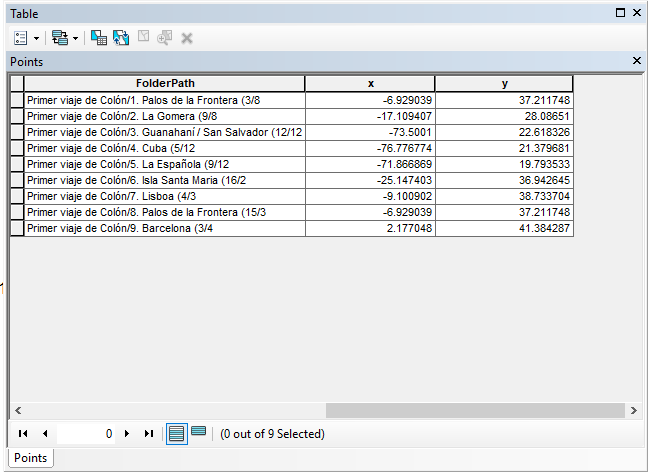

# ¿Cuál es el problema a tratar?
Conocer la historia del descubrimiento de Cristóbal Colon
# ¿Por qué una experiencia interactiva ayuda a resolverlo?
Porque es una forma didáctica de comprender los hechos, además de cierta forma nos muestra animaciones y la ubicación del hecho histórico
# Descripción de los datos (tipos de geometrías, atributos, sistemas de referencia, urls para descarga de la información, etc)
Geometría: tipo punto
Atributo: Ubicación, fecha
Sistema de referencia WGS84
KML
# URL:
(«Viajes de Cristobal Colon», s. f.)
Viajes de Cristobal Colon. (s. f.). Recuperado 15 de diciembre de 2019, de Google My Maps website: https://www.google.com/maps/d/viewer?mid=1XFbAS3b-Q_fSwjDka3_7VRByyJo
# Descripción del procesamiento realizado a los datos (ejm: transformaciones, filtros, geoprocesamiento, sql's de postgis, etc).
Primero se descargo el archivo KML, luego se cargo en Arcmap. Para ello se convirtió el kml en layer 

Y de esta forma poder visualizar los datos

Para cargar los puntos como se tienen las coordenadas se subo el archivo shp en un comprimido .zip, para poder visualizarlas en ArcGIS online

# Descripción de las diferentes técnicas y métodos utilizados para la visualización de datos. (Incluir slds, css, etc)
Para cambiar el estilo se hizo por medio de arcgis online, eligiendo un único símbolo.

# Descripción breve de las diferentes herramientas y procedimientos utilizadas para publicar el contenido en la web.
Le agregamos el etiquetado y para guardar el mapa ya establecido, vamos a la opción guardar como.

Luego se abre el story maps, y se inicia a construir la historia sobre el descubrimiento de colon 

# Ventajas / desventajas / dificultades de la publicación de mapas utilizando herramientas en la nube respecto al software desktop.
## Ventajas: 
•	Se puede compartir de todos
•	Tiene más opciones de interacción 
•	Se puede almacenar la información en la nube
•	Es más rápida y precisa disponibilidad de datos e información 

## Desventajas
•	Hay información que no se sincroniza si no se tiene un servidor y una base de datos.
•	Conexiones a Internet lentas pueden causar dificultades de navegación 
•	La plataforma utilizada es paga
# Url público de la o la experiencia interactiva
https://storymaps.arcgis.com/stories/9633b3e019f14e16b1a8eabc0363d87c

