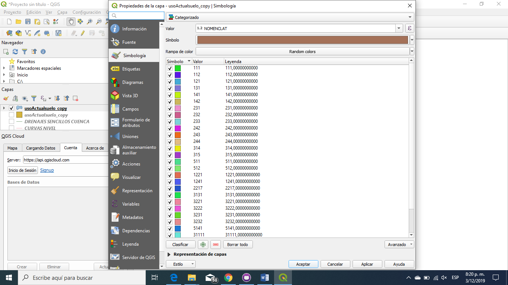
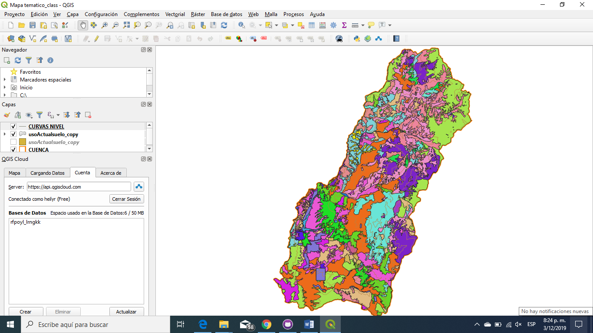
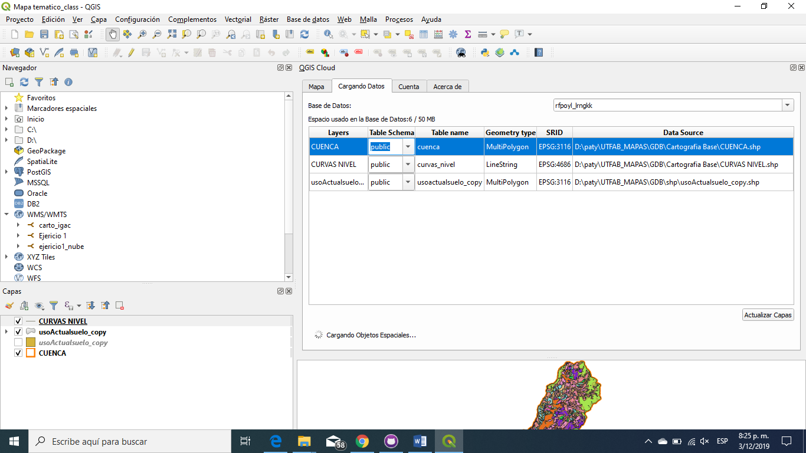

# Tarea 1

## Título

Mapa Clasificación del uso del suelo

## Descripción

El uso y cobertura actual de la tierra dominantes en los territorios municipales que conforman el AMB, Bucaramanga, Floridablanca, Girón y Piedecuesta, los más poblados de la UTFAB

##  Cuál es el problema a tratar?

Con el fin de contar con una clasificación de las microcuencas que permitiera un análisis relacional desde el uso del suelo, como uno de los factores que determinan el uso del agua en la cuenca de la UTFAB, se realizó una clasificación altitudinal de las microcuencas considerando el punto de vista morfométrico y la utilización del recurso suelo. 

##  Por qué un mapa ayuda a resolverlo?

Desde la antigüedad el hombre ha tenido la necesidad de comunicarse, desde entonces se plasmaban dibujos que simbolizaban un lugar, una ruta, un enemigo, una persona y demás. En este caso realizamos una clasificación según corine land cover del uso del suelo en la cuenca del oro  y cuenca del surata con el fin se saber el aprovechamiento de los recursos hídricos y así determinar cuáles son las zonas de protección. En el mapa podemos observar las unidades y así a simple vista poder determinar cuál es a zona de protección entre esas dos cuencas. En este caso como podemos observar se tienen diversas coberturas pero si realizamos la clasificación de acuerdo al nivel de jerarquía podemos distinguir mejor las zonas.

## Fuente de datos

Elaboración a partir de datos del POMCA río Alto Lebrija, 2018

##  Herramientas

- QGIS
- QgisCloud

##  Proceso Realizado

- Se creó cuenta gratuita en QgisCloud https://qgiscloud.com/
- En QGIS se instaló del plugin de qgiscloud

- Se realizo la reaclasificacion segun el tipo de uso del suelo.
- Luego se realizo una edición de la simbologia
-Se inicio sesion en QGIS Cloud

- Luego se realiza el cargue de datos en la base de datos y se realiza la publicación

